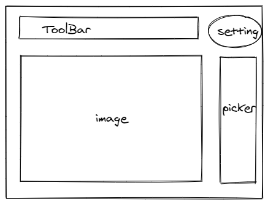

# Current Status
界面设计暂时用下面这个，虽然现在只是把区域划分了一下。。

# Arrangement
## TODO
- [x] 读取图片/文件夹
  - [x] 可自动打开同目录文件夹（选项）
  - [ ] 根据时间或者文件名排序，并在右侧显示（一列按钮）
  - [ ] 
- [ ] 查看的选项
  - [ ] 旋转
  - [ ] 放缩
  - [ ] 文件信息
  - [ ] 上一个/下一个图片
  - [ ] 全部图片视图
- [ ] 基本的编辑功能
  - [ ] 剪裁
  - [ ] 旋转、翻转
  - [ ] 画笔
- [ ] 可能加入的功能
  - [ ] 滤镜
  - [ ] 水印
  - [ ] 几何图形
  - [ ] 消除
  - [ ] 以及各种花里胡哨的
## LATER

- [ ] 用户体验
  - [ ] 启动、图片切换、加载等的动画
  - [ ] 保存会话记录
  - [ ] 批量处理
  - [ ] 可更改的软件设置
- [ ] 优化？
  - [ ] 异步处理
  - [ ] 多线程
  - [ ] GPU加速
  - [ ] 减小app体积（刚开始就已经14MB了）
  - [ ] portable

